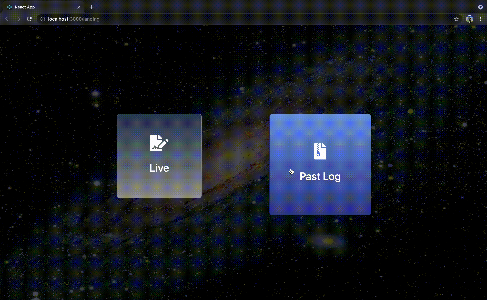

# NASA SPACE APPS CHALLENGE 2021

## LUNAR SURFACE OPERATIONS: REAL-TIME COLLABORATION

### Team members

- Tan Hoe Theng
- Sim Jin Yi
- Tan Wei Yang
- Jaclyn Neoh Su Ying
- Lau Kuan Sin
- Yap Wei Juin

## MERN stack

## Demo

### Login

### Register

### Landing

### Live Logs

.png>)

### Past Logs

### Live Communication & Editing

### Locked Past Logs

